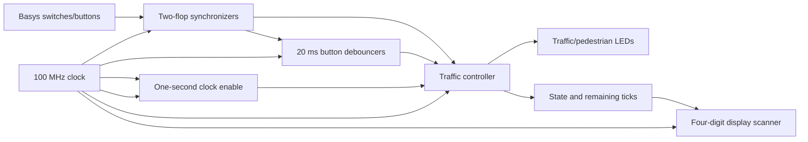
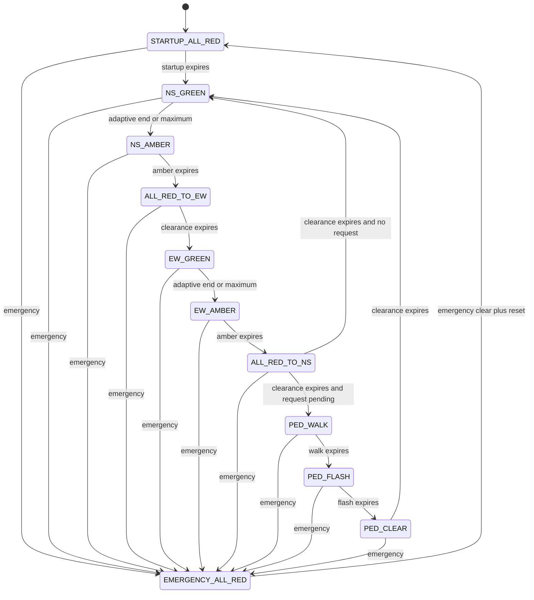

# Adaptive Basys 3 Traffic-Junction Controller

A portfolio-quality SystemVerilog demonstration of a safety-aware, adaptive road
junction controller for the Digilent Basys 3 (`xc7a35tcpg236-1`). The design uses
one 100 MHz clock domain, clock-enable timing pulses, an enumerated synchronous
Moore FSM, synchronized inputs, debounced buttons, a remembered pedestrian
request, a sticky emergency mode, LED signal indications, and a multiplexed
four-digit status/timer display.

> **Safety notice:** This is an educational FPGA demonstration. It is not a
> certified road-traffic controller or functional-safety system. A real design
> requires hazard analysis, redundant monitoring, verified lamp drivers,
> fail-safe power behavior, diagnostics, certified development processes, and
> an independent hardwired safety path able to force all traffic signals red
> even if the FPGA, clock, firmware, or power system fails.

## Hardware and software

- Digilent Basys 3, Artix-7 `xc7a35tcpg236-1`
- 100 MHz onboard oscillator
- SystemVerilog RTL; no vendor IP and no generated/gated clocks
- Icarus Verilog 12.0 or another SystemVerilog simulator
- Verilator 5.x for independent lint (optional)
- AMD/Xilinx Vivado with Artix-7 device support for implementation
- Bash and Make for the convenience targets

Pin locations are selected from Digilent's official
[Basys 3 Master XDC](https://github.com/Digilent/digilent-xdc/blob/master/Basys-3-Master.xdc).

## Architecture



The board wrapper in `rtl/traffic_controller_top.sv` handles physical I/O. The
controller in `rtl/traffic_controller.sv` has only synchronous inputs, so it is
portable and independently testable. All timing values are parameters measured
in `tick_i` pulses. The hardware wrapper generates one pulse per second; the
testbench drives ticks directly and uses short timing parameters.

## FSM

State codes are decimal 00 through 10.



| Code | State | North-South | East-West | Pedestrian | Nominal duration / exit |
|---:|---|---|---|---|---|
| 00 | `STARTUP_ALL_RED` | Red | Red | Stop | 2 s |
| 01 | `NS_GREEN` | Green | Red | Stop | Adaptive, 8–15 s |
| 02 | `NS_AMBER` | Amber | Red | Stop | 3 s |
| 03 | `ALL_RED_TO_EW` | Red | Red | Stop | 1 s |
| 04 | `EW_GREEN` | Red | Green | Stop | Adaptive, 8–15 s |
| 05 | `EW_AMBER` | Red | Amber | Stop | 3 s |
| 06 | `ALL_RED_TO_NS` | Red | Red | Stop | 1 s; choose pedestrian or NS |
| 07 | `PED_WALK` | Red | Red | Walk | 6 s |
| 08 | `PED_FLASH` | Red | Red | Flashing stop | 4 s |
| 09 | `PED_CLEAR` | Red | Red | Stop | 1 s |
| 10 | `EMERGENCY_ALL_RED` | Red | Red | Stop | Sticky until clear plus reset |

All Moore outputs depend only on registered state and registered elapsed time.
Default output assignments are all-red, walk-off, stop-on. An invalid state
encoding therefore presents safe outputs and returns toward startup on a later
timing enable.

## Precise adaptive timing policy

Each green begins with elapsed count zero. A transition evaluated on the Nth
tick gives exactly N whole timing intervals; this convention avoids an N+1
off-by-one error.

Before minimum green, the phase cannot end. At and after minimum green:

1. End immediately on a timing tick if the opposing vehicle sensor or a pending
   pedestrian request is present.
2. End if active-direction demand is absent. This prevents an empty road from
   holding green unnecessarily.
3. Extend while active-direction traffic remains and no conflict is waiting.
4. End unconditionally at maximum green.

The fixed alternating road sequence and maximum-green bound prevent either road
from starving. A pedestrian request is served at the next
`ALL_RED_TO_NS` decision. In the worst phase alignment, its wait to `PED_WALK`
is bounded by one maximum NS phase, one maximum EW phase, the intervening amber
and all-red intervals (38 timer ticks with defaults), plus input
synchronization/debounce latency.

The pedestrian button generates one debounced rising-edge pulse. The controller
latches it even when brief and clears it only when `PED_CLEAR` completes. A new
request arriving exactly as clearance completes wins over the clear and remains
pending for the next service.

## Emergency behavior

SW15 is synchronized but deliberately not debounced: a conservative assertion,
including contact bounce, latches the emergency. The controller checks that
synchronized level on every 100 MHz edge, independently of the one-second tick,
and enters `EMERGENCY_ALL_RED` on the next controller edge. Both roads are red,
walk is off, stop is on, and LED15 illuminates.

Releasing SW15 does not resume operation. With SW15 low, press BTNC; the
synchronous reset clears the emergency latch and restarts through the full
`STARTUP_ALL_RED` interval. Reset cannot override an emergency that remains high.

## Basys 3 mapping

| Board control | Function |
|---|---|
| SW0 | North-South vehicle sensor |
| SW1 | East-West vehicle sensor |
| SW15 | Emergency stop input |
| BTNU | Pedestrian request |
| BTNC | Reset / emergency recovery after SW15 clears |

| LED | Function |
|---:|---|
| 0, 1, 2 | North-South red, amber, green |
| 3, 4, 5 | East-West red, amber, green |
| 6, 7 | Pedestrian walk, stop |
| 8 | Pedestrian request pending |
| 9, 10 | Synchronized NS and EW sensor levels |
| 11–14 | Binary state code bits 0–3 |
| 15 | Emergency active |

The seven-segment format is `SSrr`: two decimal state-code digits followed by
two remaining-tick digits. Green states count down to the hard maximum, even
when the adaptive policy may end them earlier. The display and anodes are
active-low as required by the Basys 3 hardware.

## Build and simulation

From Linux/WSL:

```bash
cd /mnt/c/tmp/basys3-adaptive-traffic-controller
./scripts/run_simulation.sh
# or
make sim
make lint
```

The self-checker prints `TESTBENCH PASS` or terminates with `$fatal`. A VCD is
written to `build/traffic_controller.vcd`. The checked run used Icarus 12.0 and
completed 3,461 checks.

Independent strict lint used:

```bash
verilator --lint-only --timing -Wall -Wno-UNUSEDSIGNAL \
  --top-module traffic_controller_top rtl/*.sv
```

`UNUSEDSIGNAL` is disabled only because the top intentionally receives the
controller's debug elapsed-time output without presenting it on a pin.

## Vivado implementation

### Open as a persistent Vivado project

On Windows, double-click `launch_vivado_project.bat`. The launcher locates
Vivado 2025.1, creates `vivado/basys3_adaptive_traffic_controller.xpr` when it
does not yet exist, and opens the project in the Vivado GUI. It first checks
`PATH` and `XILINX_VIVADO`, then the common AMD/Xilinx installation locations.

From a Vivado-enabled Linux/WSL shell, run:

```bash
./launch_vivado_project.sh
```

The generated project contains:

- `traffic_controller_top` as the synthesis top;
- all six synthesizable SystemVerilog files in `sources_1`;
- the verified Basys 3 XDC in `constrs_1`;
- both testbenches in `sim_1`, with `tb_traffic_controller` selected as the
  simulation top; and
- standard `synth_1` and `impl_1` runs targeting `xc7a35tcpg236-1`.

The project is generated from `scripts/create_vivado_project.tcl`, keeping the
source archive portable across machines and Vivado patch versions. To recreate
it manually from the project root:

```powershell
vivado.bat -mode batch -source scripts/create_vivado_project.tcl -notrace
```

In the GUI, use **Run Simulation > Run Behavioral Simulation**, followed by
**Run Synthesis**, **Run Implementation**, and **Generate Bitstream**. The
self-checking simulation prints `TESTBENCH PASS` in the Tcl console when it
completes successfully.

For an automated project-mode synthesis, implementation and bitstream build:

```powershell
vivado.bat -mode batch -source scripts/build_vivado_project.tcl -notrace
```

The bitstream is copied to `artifacts/traffic_controller_top.bit`, and
project-mode reports are written to `reports/`.

### Non-project implementation flow

On a shell where `vivado` is on PATH:

```bash
make vivado
```

Or on the validated Windows installation:

```powershell
& 'C:\Xilinx\2025.1\Vivado\bin\vivado.bat' `
  -mode batch -source scripts\run_vivado.tcl -notrace
```

The Tcl flow synthesizes, optimizes, places, physically optimizes, routes, and
writes text reports to `reports/`. It fails if the worst setup path has negative
slack. The XDC declares human inputs and direct LED/display outputs as false
paths because they have no external synchronous timing contract; internal paths
remain constrained by the 10 ns clock.

### Measured validation summary

- Icarus 12.0 compile and self-checking simulation: **PASS**, 3,461 checks.
- Verilator 5.020 strict top-level lint: **PASS**, no diagnostics.
- Vivado 2025.1 synthesis and implementation: **PASS**.
- Post-route timing: all specified constraints met; WNS **+1.089 ns**, TNS
  **0.000 ns**, WHS **+0.122 ns**, THS **0.000 ns**.
- Post-route utilization: **188 LUTs (0.90%)**, **139 flip-flops (0.33%)**,
  **34 IOBs (32.08%)**, and **1 BUFG (3.13%)**.
- DRC: **0** checks found. Methodology: **0** checks found.
- Clock analysis: one BUFG-backed 100 MHz clock; no MMCM/PLL; zero
  unclocked or multiclocked register/latch pins. No inferred latch warning.
- `git diff --check`: see final handoff; the supplied workspace was not a Git
  repository, so the project is checked using a temporary no-index repository.

Icarus prints a harmless message that constant bit-selects in `always_comb`
sensitivity analysis cause it to include all bits. This is an Icarus limitation,
not an RTL error. Vivado's only synthesis warning is that this small design does
not meet the criteria for parallel synthesis.

## Demonstration procedure

1. Program the board, set SW15 low, and press BTNC. Observe state 00 with both
   red LEDs for two seconds, then state 01 / NS green.
2. Leave both sensor switches low. Each green ends after eight seconds.
3. Raise the active-direction sensor and keep the opposing sensor low. Its green
   extends, but changes at 15 seconds. Raise the opposing sensor after minimum
   green to request the next direction.
4. Briefly tap BTNU. LED8 remains on after release. Observe the request served
   after the EW sequence: walk, flashing stop, clearance, then NS green.
5. Raise SW15 during any state. On human timescales the all-red/emergency result
   is immediate. Lowering SW15 alone does nothing. Press BTNC after lowering it
   and observe a fresh startup all-red interval.

## Repository layout

```text
rtl/          synthesizable controller, timing, CDC, debounce, and display RTL
tb/           self-checking accelerated testbench
constraints/  verified Basys 3 pins and timing intent
scripts/      portable simulation and non-project Vivado flows
vivado/       generated Vivado project location and usage notes
docs/         architecture, verification plan, and interview preparation
reports/      text reports/logs from validation
```

## Limitations and extensions

- Sensors are simple presence levels; there is no queue length, speed, fault,
  or sensor-health estimation.
- The demonstration has no real lamp-voltage/current feedback or redundant
  independent interlock.
- The one-second policy granularity is intentionally simple.
- Pedestrian accessibility features such as audible indications are absent.
- Useful extensions include formal property checking, randomized constrained
  verification, watchdog/redundant controllers, sensor fault detection,
  configurable timing over UART, and measured traffic-density algorithms.

See [architecture](docs/architecture.md),
[verification plan](docs/verification_plan.md), and the
[interview guide](docs/interview_guide.md) for deeper detail.
