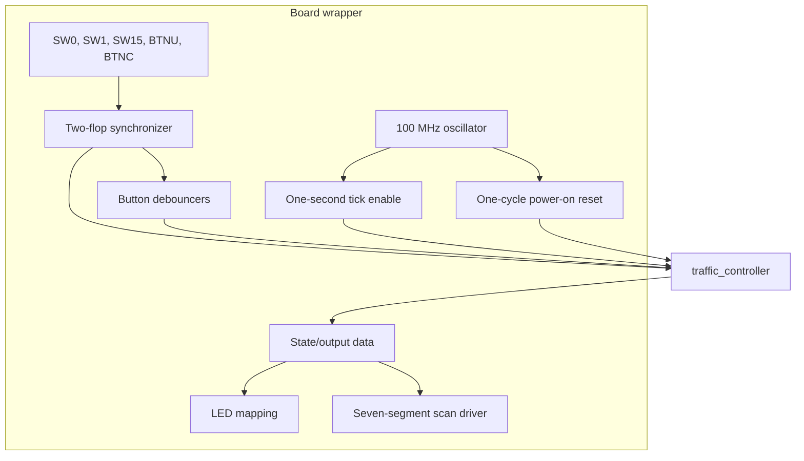

# Architecture

## Design goals

The design separates portable junction policy from board-specific I/O, keeps all
logic in one clock domain, makes safety-dominant behavior obvious in code, and
keeps every timing value overrideable for fast simulation.

## Block structure

| Module | Responsibility |
|---|---|
| `traffic_controller` | FSM, adaptive transitions, timers, request/emergency latches, Moore outputs |
| `input_synchronizer` | Two flip-flops per asynchronous input, marked `ASYNC_REG` |
| `button_debouncer` | Requires a stable level for a parameterized interval and emits one rising pulse |
| `tick_generator` | One-cycle clock enable; never creates a new clock |
| `seven_segment_driver` | Four-way active-low scan using a clock enable counter |
| `traffic_controller_top` | Basys 3 integration, reset, display formatting, and LED mapping |

## Clocking and reset

The only clock is the Basys 3 100 MHz oscillator, routed through one BUFG by
Vivado. Timer and display counters generate one-cycle enables. No procedural
block treats an enable as a clock. This avoids extra clock trees, simplifies
timing analysis, and keeps every state element synchronous.

An Artix-7 initialization value produces a one-cycle power-on reset. BTNC is
synchronized and debounced; its stable high level is the normal synchronous
reset. The controller gives an asserted synchronized emergency higher priority
than reset, so reset cannot resume traffic while emergency remains active.

## CDC and debounce

Every switch/button passes through two cascaded flip-flops. The first can become
metastable; the second greatly reduces the probability that metastability
propagates into functional logic. `ASYNC_REG` and `SHREG_EXTRACT=NO` preserve the
physical intent.

BTNU and BTNC then pass through independent stable-count debouncers. At 100 MHz,
the default 2,000,000 cycles represent 20 ms. The pedestrian interface supplies
one pulse per physical press, even if held high. Emergency deliberately bypasses
debounce after synchronization so any observed assertion latches the safe mode.

## State, transition, and output partitions

The controller uses a 4-bit enumerated `state_t`. Sequential blocks contain the
state register, elapsed timer, pedestrian pending bit, and sticky emergency bit.
One `always_comb` block calculates `state_d`; another decodes outputs from
registered state/time. Nonblocking assignments are used in sequential logic.

Fixed-duration states compare `elapsed + 1` with their duration on each tick.
This means a parameter value N consumes exactly N tick pulses. Transitions occur
only on `tick_i`, except emergency entry/reset, which are checked every system
clock edge.

The registered elapsed-time LSB makes pedestrian stop alternate during
`PED_FLASH`. Because it is registered state, the output remains Moore-style: no
asynchronous input can directly affect an output.

## Request and emergency latches

`ped_request_pending_o` is set by any request pulse. It stays high through road
phases and the entire pedestrian sequence. It clears on the tick leaving
`PED_CLEAR`. Set wins if a new pulse coincides with that clear, so a late request
is not lost.

`emergency_latched_q` sets on any synchronized high sample. While set, state is
forced to `EMERGENCY_ALL_RED` on every system edge. It clears only when reset is
sampled while the emergency input is low. The controller then starts from
`STARTUP_ALL_RED`.

## Safety invariants by construction

- Default decode is NS red, EW red, pedestrian stop, walk off.
- Each normal road decode activates exactly one of red/amber/green.
- No state decodes two green roads.
- Pedestrian walk exists only in `PED_WALK`, where both roads retain red.
- Pedestrian and emergency states retain both vehicle reds.
- Invalid encodings retain safe defaults.
- Amber always precedes the relevant all-red clearance; a conflicting green can
  never be selected directly from a green state.

These are useful design properties, not a functional-safety certification.

## Timing constraints

The XDC creates a 10 ns clock and assigns verified Basys 3 Rev. B pins. Switches
and buttons are asynchronous human inputs; LEDs and the display are direct board
indicators with no external synchronous receiver. They are explicitly false
pathed at the device boundary. All internal register-to-register logic remains
timed, including both synchronizer stages.

Post-route implementation reported one BUFG, no generated clock resources, no
unclocked/multiclocked registers or latches, and no unconstrained paths.
